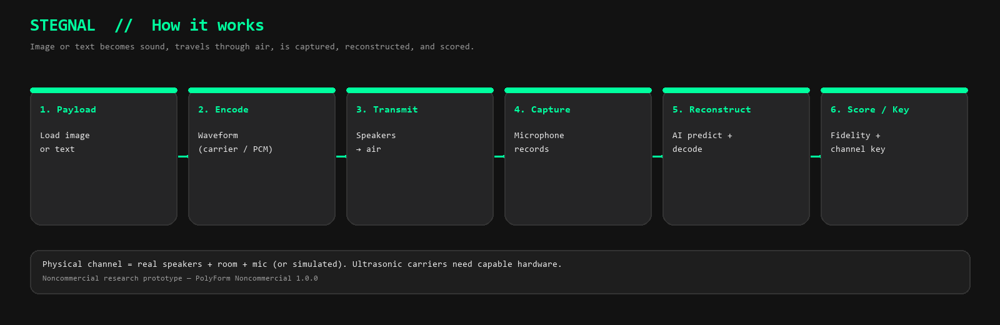
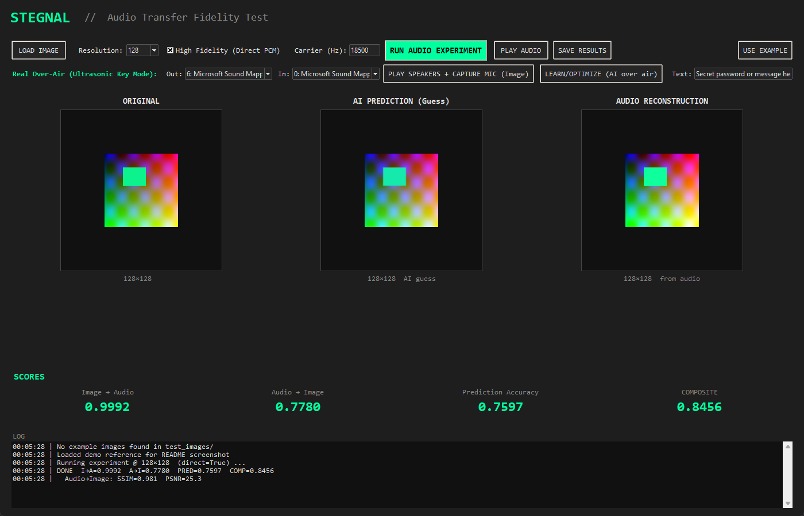
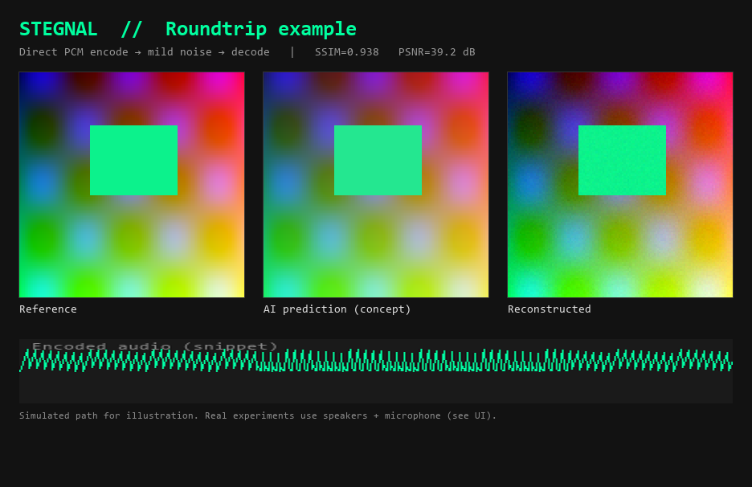
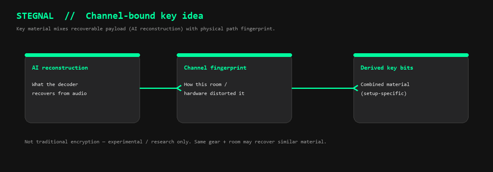

# Stegnal

[](LICENSE.md)
[](https://www.python.org/downloads/)
[](https://github.com/Stelliro/Stegnal/actions)

**Steganography + signal** experiments: send images or text as sound (including high-frequency / ultrasonic carriers), capture them through real speakers and mics, use AI-style prediction to reconstruct what survived the channel, and derive channel-bound key material from the reconstruction plus the physical path fingerprint.

| | |
|---|---|
| **What it is** | Research prototype for real acoustic (over-air) image/text transmission |
| **Who it’s for** | Hobbyists, students, researchers, noncommercial experimenters |
| **License** | Free to use, share, and modify — **noncommercial only** ([details](#license)) |
| **Status** | Focused prototype. Not a production secure messaging system |

**Keywords:** steganography, audio steganography, ultrasonic communication, acoustic channel, image-to-audio, covert channel, signal processing, channel fingerprinting, noncommercial research

## At a glance

<p align="center">
  
</p>

**Desktop UI** (real device selection, simulated + over-air experiments, scores):

<p align="center">
  
</p>

**Example roundtrip** (image → audio → decode; mild simulated noise):

<p align="center">
  
</p>

**Channel-bound key idea** (research / experimental — not traditional encryption):

<p align="center">
  
</p>

> Regenerate these assets (UI capture uses the **secondary monitor** when present):  
> `python scripts/generate_readme_images.py`

## Core Idea

- Convert an image or text payload into an audio waveform (using AM carrier or direct PCM; configurable high carrier freq for ultrasonic-ish operation).
- Play the waveform through speakers.
- Capture via microphone (real acoustic channel: speakers → air/room → mic).
- AI (heuristic predictor + learned post-processing corrections) predicts/reconstructs what the payload should look like after the channel.
- Score reconstruction fidelity (image/audio), prediction accuracy, and composite.
- Derive a "secure encoded key" by combining the AI-reconstructed payload with a fingerprint of the actual physical channel effects (unique per hardware + environment). This provides a mix of reliable reconstruction (AI) and channel-specific entropy (physical).
- Simple adaptation/"learning" over real captures to improve reconstruction quality on a specific setup.

The physical acoustic channel acts as a natural source of variation/hardness for the key, while AI helps make the payload recoverable despite distortions. Suitable for experiments in covert data transfer or channel-bound key material over sound.

**Note on security and "encryption":** This is not a cryptographically strong encrypted channel in the traditional sense. The "encryption" effect comes from steganographic modulation + the difficulty of perfectly replicating or eavesdropping the exact physical acoustic transfer without equivalent hardware and proximity. An attacker with similar equipment in a similar environment could potentially recover similar material. Use for research/proof-of-concept only.

## Hardware Notes

Standard consumer speakers and microphones have limited high-frequency response. Ultrasonic or near-ultrasonic carriers (e.g. 18kHz+) often require specialized hardware for usable range and fidelity:

- **Transducers (speakers):** 40kHz piezo ultrasonic transducers (common in distance sensors/humidifiers; cheap on AliExpress/Amazon, e.g. TCT-16T or similar). Arrays + proper drivers/amplifiers recommended for volume.
- **Mics:** Ultrasonic-capable MEMS mics (e.g. Knowles SPH series or similar), piezo contact transducers (for direct coupling tests), or measurement mics with extended high-freq response.
- **For testing:** Start with direct contact (mic/transducer touching speaker) to bypass air loss. Consumer "ultrasonic" claims are often marginal.
- Sample rates of 96kHz+ recommended for high carriers.

See code for carrier_freq support. Real results will vary wildly by hardware, distance, room, volume, and alignment.

## Getting Started

### Quick start (Windows)

Use the launchers (they bootstrap a Python 3.12 venv on first run):

- `launch_stegnal_ui.bat` — launches the focused Tkinter UI for experiments, real device selection, play/capture, and channel adaptation (`python -m stegnal ui`).
- `launch_terminal.bat` — the customtkinter terminal (`app.py`).

### Manual

```bash
python3.12 -m venv .venv
source .venv/bin/activate
pip install -e ".[ui]"
```

Windows PowerShell equivalent:

```powershell
& "$env:LocalAppData\Programs\Python\Python312\python.exe" -m venv .venv
.\.venv\Scripts\Activate.ps1
pip install -e ".[ui]"
```

Requires Python 3.12+ preferred. `sounddevice` for real audio I/O.

## Usage

### UI (recommended for experiments)

`python -m stegnal ui` or via launcher.

- Load image or enter text.
- Set resolution and carrier frequency (high values for ultrasonic-ish).
- Select real audio devices (speakers Out, mic In).
- Run simulated or real play/capture.
- View AI prediction vs actual reconstruction.
- Scores for fidelities and prediction.
- "Learn/Optimize" runs real captures to adapt post-processing for your channel/hardware.
- Derive and view secure key material.

Supports both image and text payloads.

### CLI

Basic encode/decode still supported for waveform generation (see `stegnal --help`).

For real over-air and key work, the UI is the primary interface.

## Key Features (Current)

- Waveform generation from image or text (direct PCM for fidelity or AM carrier).
- Configurable carrier frequency (for high-freq/ultrasonic experiments).
- Real speaker play + mic capture (via AudioEngine + sync pulses).
- Heuristic AI predictor for post-channel image appearance + simple learned corrections (contrast/gamma/brightness) adapted over real trials.
- Scoring: image-to-audio, audio-to-image, prediction accuracy, composite.
- Secure key derivation: combines AI-reconstructed payload with physical channel fingerprint (e.g. high-freq spectral features from capture).
- Focused, streamlined UI for real-air testing and adaptation (no heavy legacy evolution UI).
- Text and image support.

## What This Is Not

- Not a drop-in replacement for cryptographic encryption or secure messaging apps.
- Real-air ultrasonic performance is highly hardware-dependent and generally short-range/low-bandwidth.
- "Learning" is lightweight adaptation on reconstruction params using real captures (not full ML model training on large datasets).
- Claims are limited to experimental results on your specific hardware/setup.

## Development / Contributing

See CONTRIBUTING.md.

Run tests: `pytest`

Lint: `ruff check .`

The UI is the main focus (`src/stegnal/ui.py`); keep changes focused on real acoustic + AI prediction + key derivation.

## License

**[PolyForm Noncommercial License 1.0.0](LICENSE.md)**

| Allowed | Not allowed |
|---|---|
| Personal use, learning, hobby projects | Selling the software or selling access to it |
| Research, education, public knowledge | Using it in a commercial product or service |
| Copying, modifying, and sharing under the same terms | Using it to make money (directly or as part of a paid offering) |
| Contributions back to this project | Sublicensing under a more permissive commercial license |

Full legal text: [LICENSE.md](LICENSE.md).  
Plain language: free for everyone for noncommercial purposes; no commercial use or profiting off it.

## Acknowledgments / History

Evolved from earlier noise-packet and evolution experiments into a focused real-acoustic channel tester for image/text payloads and channel-derived keys.

For specialized hardware recommendations and further ultrasonic experiments, see the hardware notes above and test with your setup.